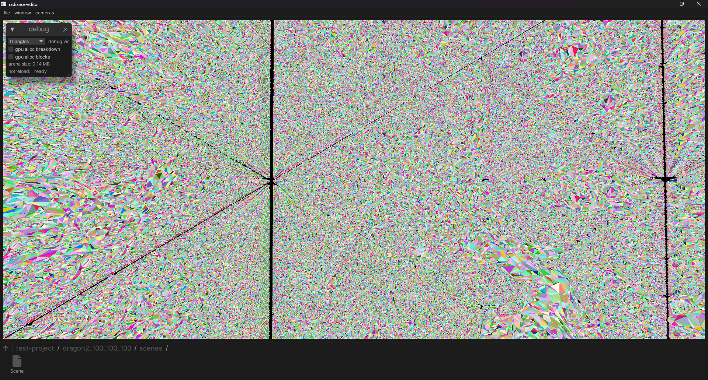
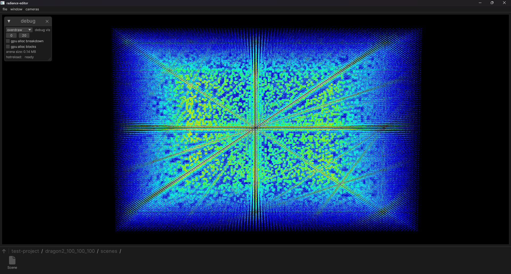
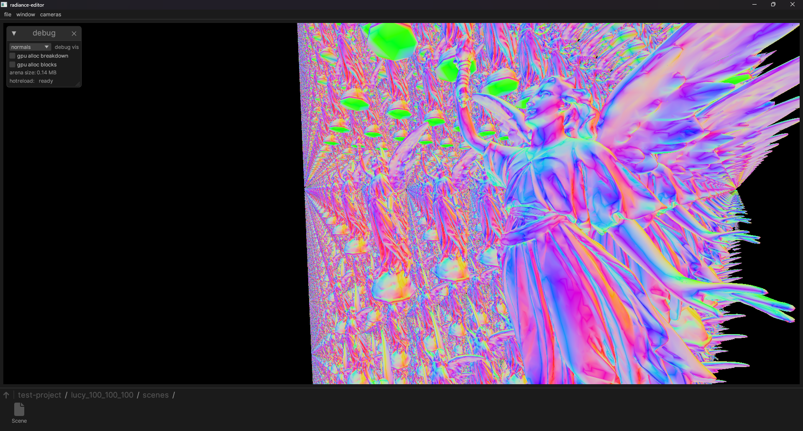
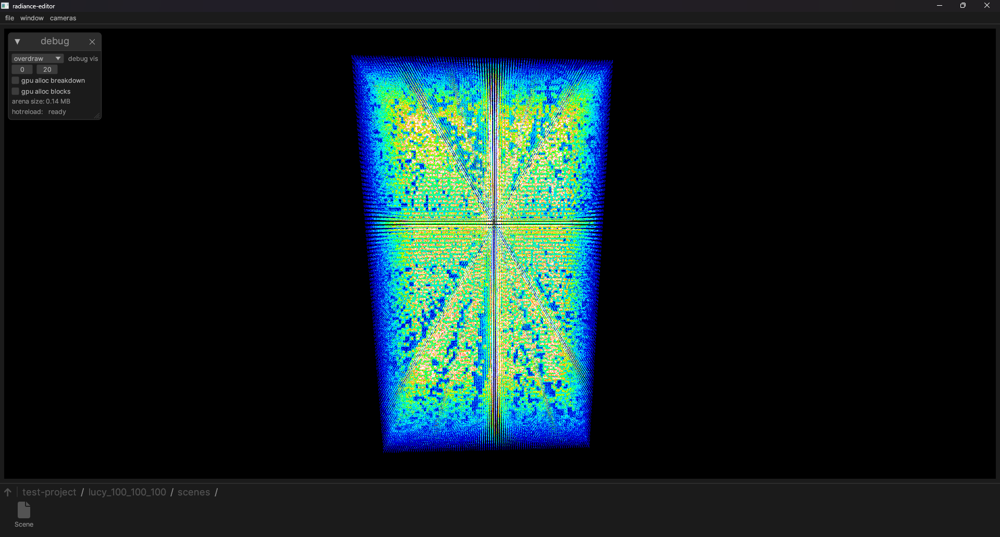
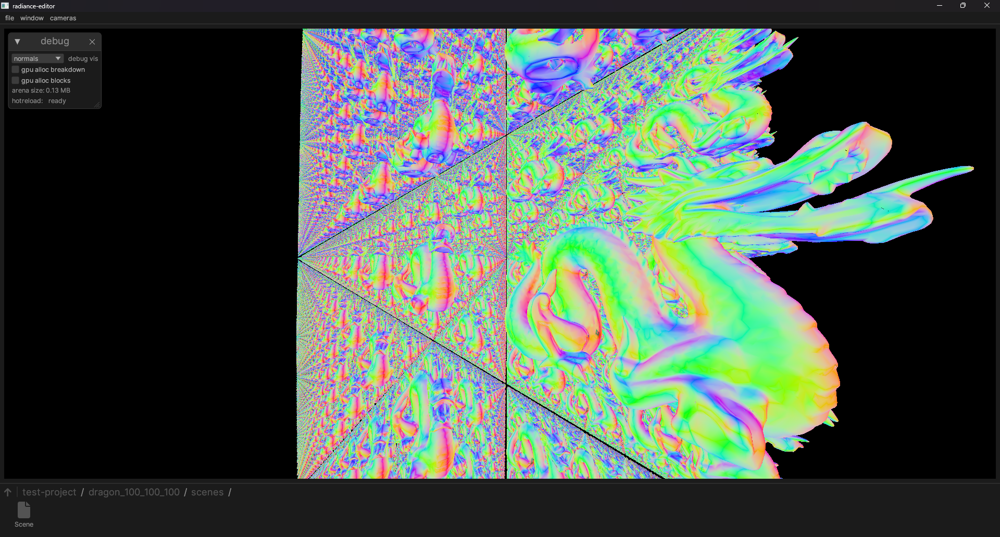
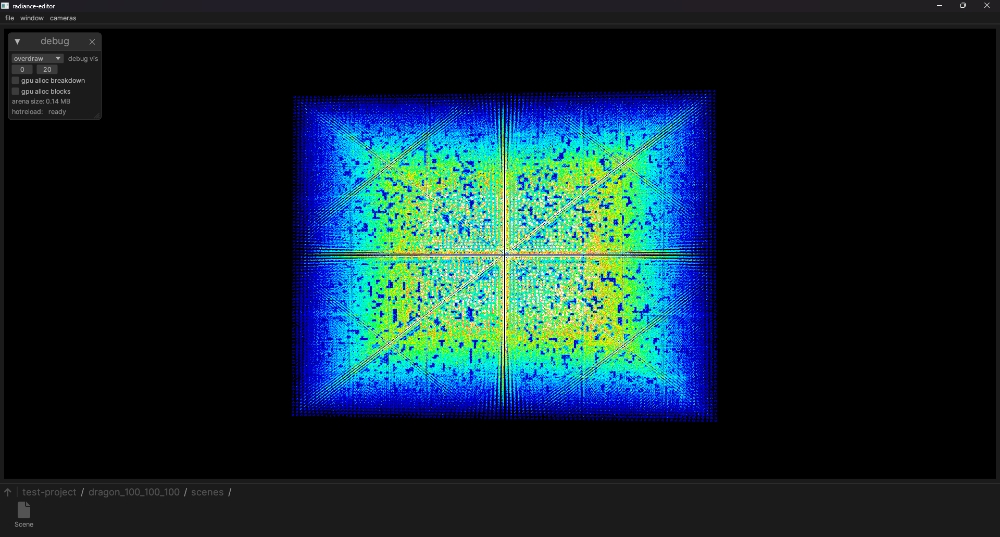

# Radiance

Radiance is a renderer and asset system.

Requires hardware raytracing, mesh shaders, and ReBAR to work at all.

# Testing

Build and run with `cargo run --release -- ./test-project`.

Double click folders/assets to navigate around, and drop a GLTF file into the window to import. You can use `gen.py` to repeatedly instance any GLTF for testing.

`dragon_100_100_100/scenes/Scene` is the Stanford Dragon repeated 100 times across each dimension, a total of 1 million dragons and about 800 billion triangles. The other test models couldn't be shipped due to GitHub size limits.

# In action

1 million XYZRGB Stanford Dragons at 165 FPS. At 7.2 million triangles each, the scene has about 7.2 trillion triangles in total. Renders at 165 FPS.

The same scene as above, showing the interior of the instanced block. Renders at 85 FPS.

The same view as above, showing the density of triangles rendered.

The same scene as above, viewed from far away with heavy overdraw. This results in a massive drop to around 55 FPS.

1 million instanced Stanford Lucy scans for a total of about 28 trillion triangles. Renders at 60 FPS.

The same scene as above, as a worst-case scenario. Falls to an unusable 18 FPS.

1 million Stanford Dragons for a total of 800 billion triangles, at 200 FPS.

The same scene as above, with heavy overdraw. Causes a drop to 54 FPS.
