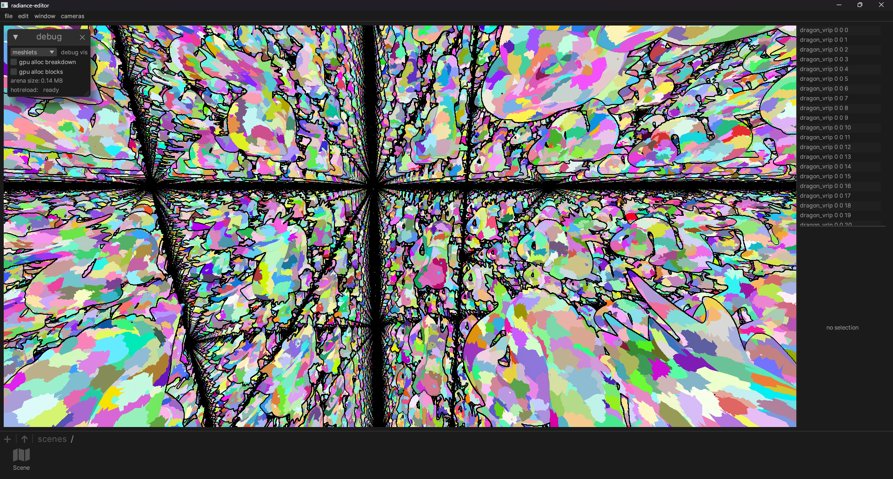
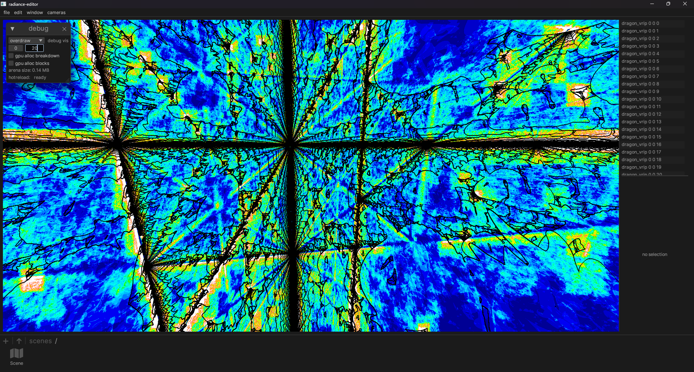
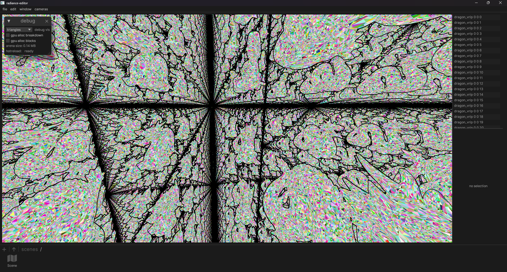
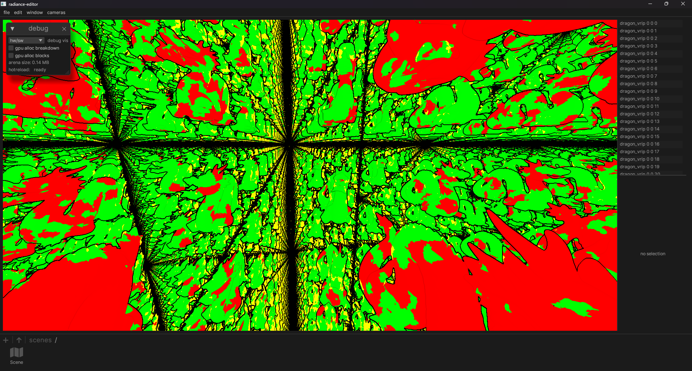
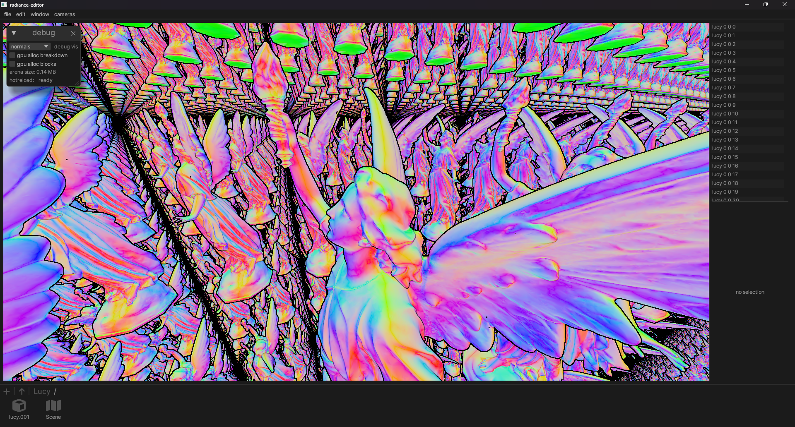
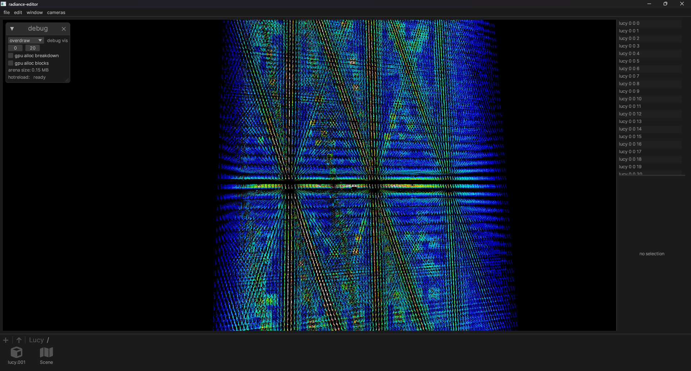

# Radiance

Radiance is a renderer and asset system.

Requires hardware raytracing, mesh shaders, and ReBAR to work at all.

# Testing

Build and run with `cargo run --release -- ./test-project`.

Double click folders/assets to navigate around, and drop a GLTF file into the window to import. You can use `gen.py` to repeatedly instance any GLTF for testing.

`Dragon/Scene` is the Stanford Dragon repeated 200 times across each dimension, a total of 8 million dragons and about 6.4 trillion triangles. The other test models couldn't be shipped due to GitHub size limits.

# In action
Due to the large instance count and lack of impostor support, the dragon scene has rather lackluster performance, taking about 5ms per frame (~200 FPS).

Clusters of the Dragon scene.

Overdraw in the Dragon scene.

Triangles in the Dragon scene.

This shows the distribution of hardware rasterized vs software rasterized meshlets.
Red is hardware rasterized while green and yellow are software rasterized.

1 million instances of the Stanford Lucy scan, leading to a total of 28 trillion triangles, rendered at 1.5ms per frame (650 FPS).

Going far away leads to a large amount of overdraw, dropping the performance down to 4.5ms per frame.

