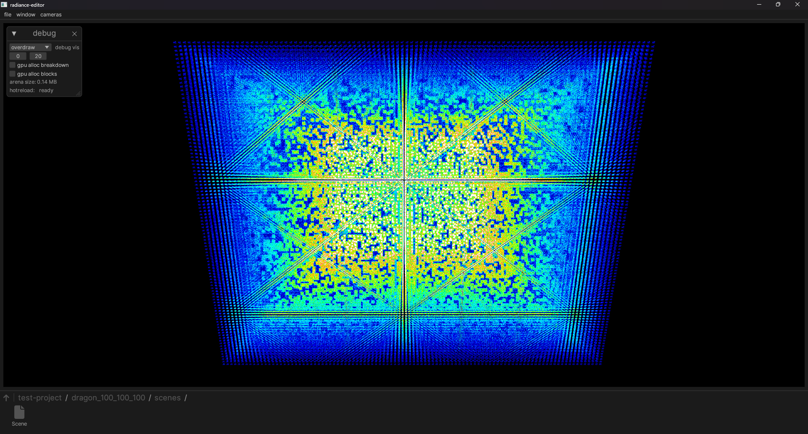

# Radiance

Radiance is a renderer and asset system.

Requires hardware raytracing, mesh shaders, and ReBAR to work at all.

# Testing

Build and run with `cargo run --release`, and open the folder `test-project`.

Double click folders/assets to navigate around, and drop a GLTF file into the window to import.

`dragon_50_50_50/scenes/Scene` is the Stanford Dragon repeated 50 times across each dimension, a total of about 100 billion triangles.

# In action

1 million Stanford Dragons rendered at 100 FPS.

The same scene as above, with heavy overdraw causing a drop to 30 FPS.
